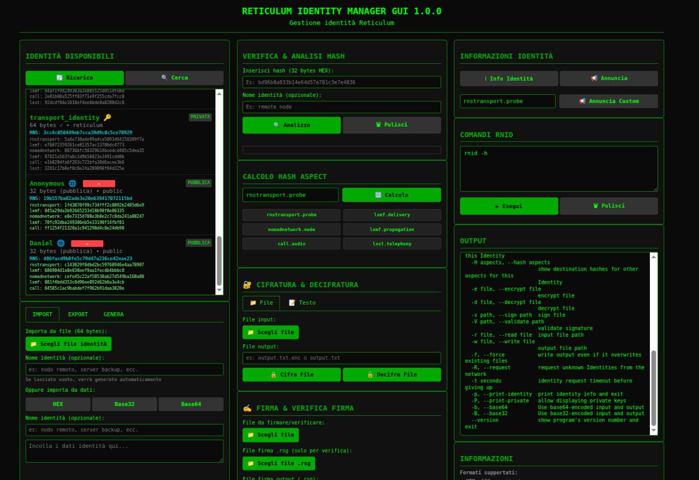
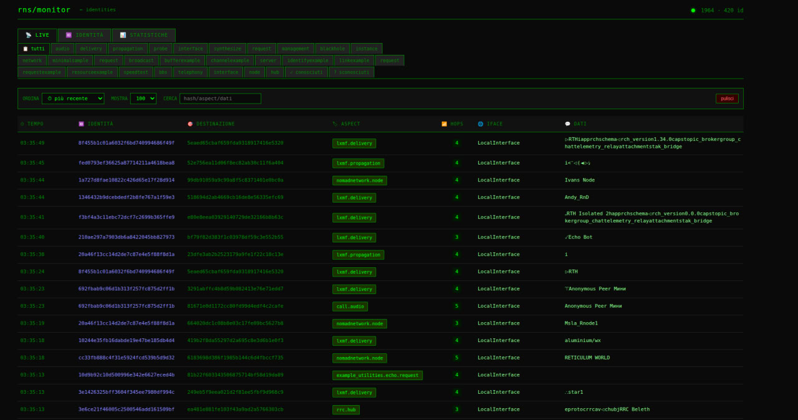
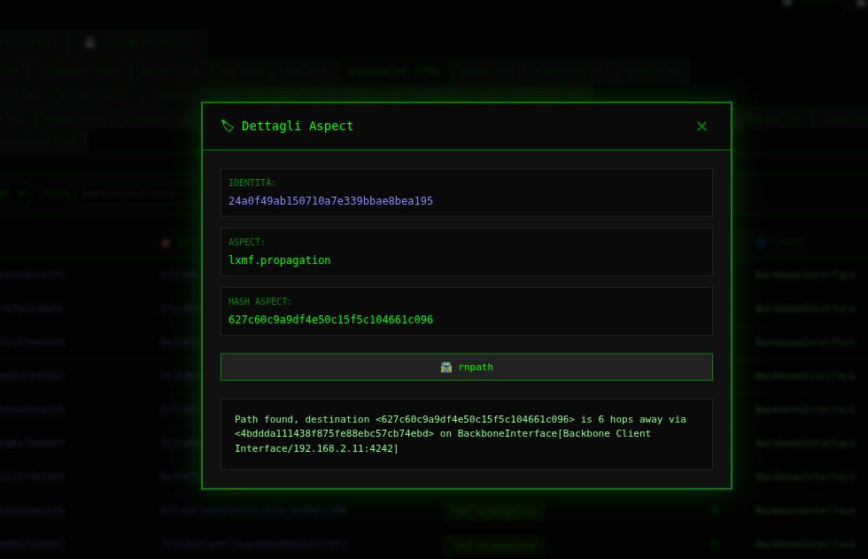
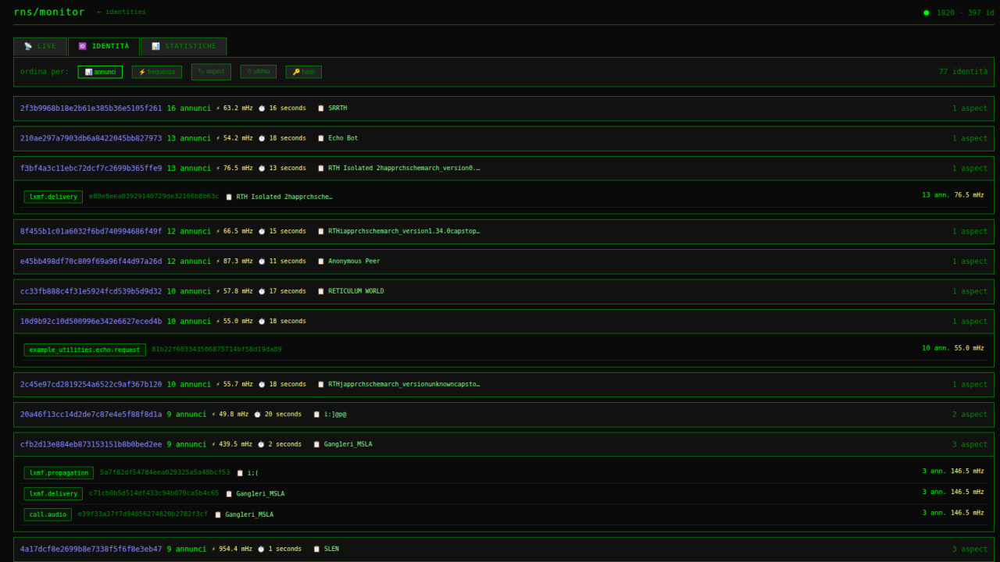
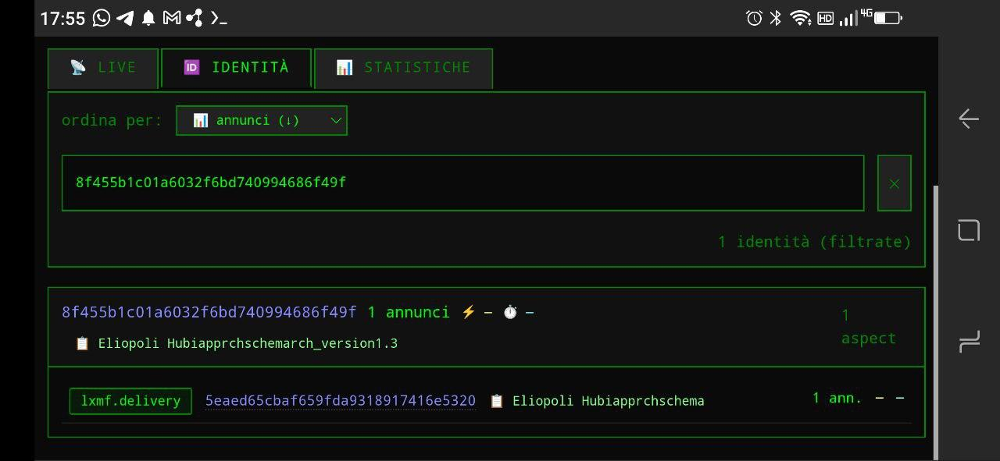
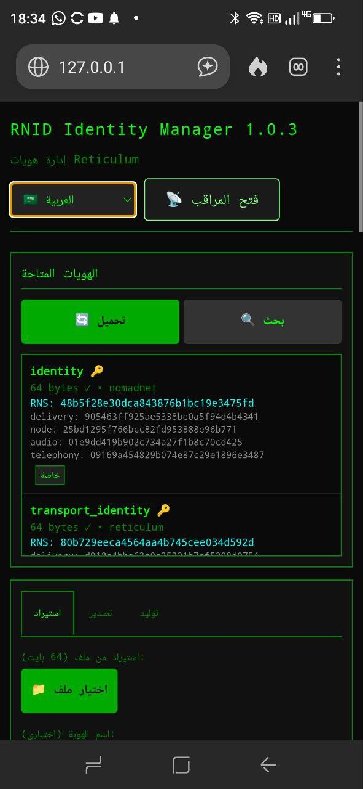
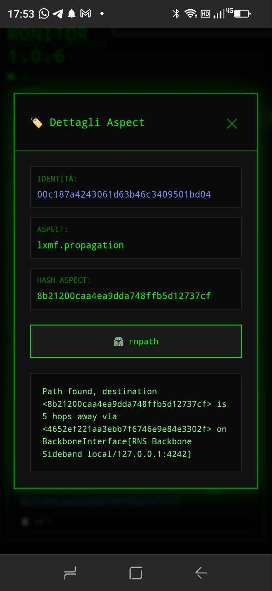

<h1 align="center">
 🔑  RNS Identity Manager & Monitor 🌐
</h1>

Interfaccia web completa per la gestione delle identità Reticulum (RNS) e il monitoraggio in tempo reale degli annunci di rete.

<h3> 📋 Panoramica</h3>



Questo progetto fornisce un'interfaccia web intuitiva per:
- **Gestire identità RNS** (creare, importare, esportare, visualizzare)
- **Monitorare annunci RNS** in tempo reale con filtri avanzati
- **Eseguire comandi RNS** (rnstatus, rnpath, rnprobe) tramite interfaccia grafica
- **Cifrare/decifrare** file e testo con identità RNS
- **Firmare e verificare** file digitalmente

<h3> ✨ Caratteristiche</h3>

### Identity Manager
- ✅ Visualizzazione di tutte le identità RNS (reticulum, nomadnet, lxmf, rnphone, meshchat)
- ✅ Importa/esporta identità in formati HEX, Base32, Base64
- ✅ Generazione nuove identità
- ✅ Verifica e analisi hash (identità pubbliche)
- ✅ Calcolo hash aspect per destinazioni RNS
- ✅ Cifratura/decifratura file e testo
- ✅ Firma digitale e verifica firme (.rsg)



### Aspect Monitor
- 📡 Monitoraggio in tempo reale annunci RNS via SSE (Server-Sent Events)
- 🔍 Filtri per aspect, ricerca testuale, ordinamento
- 📊 Statistiche dettagliate e analisi identità
- 🏷️ Riconoscimento automatico aspect con cache
- 💾 Cache persistente su disco (7 giorni di storico)
- 🖱️ Interfaccia interattiva con modal per comandi rnpath/rnprobe




## 🚀 Installazione

### Prerequisiti
- Python 3.7 o superiore
- Reticulum installato e configurato
- rnid, rnstatus, rnpath, rnprobe disponibili nel PATH

### Installazione

```bash
# Clona il repository
git clone git@github.com:argo79/RNS-Manager.git
cd RNS-Manager

# Installa le dipendenze
pip install flask

# R省i sicuro che Reticulum sia installato
pip install rns

# Avvia il server
python3 rns_manager.py


Poi apri il browser su:

    Identity Manager: http://localhost:5000/

    Aspect Monitor: http://localhost:5000/monitor
```


<h3>📁 Struttura del progetto</h3>

```ini
rns-identity-manager/
├── manager.py                 # Server Flask principale
├── Readme.md                  # This file
├── modules/
│   ├── rns_monitor.py             # Modulo RNS Monitor
├── static/
│   └── rns_monitor.css        # Stili CSS
├── templates/
│   ├── index.html              # Identity Manager
│   └── monitor.html            # Aspect Monitor
└── README.md
```


<h3>🗂️ Directory utilizzate</h3>

Il programma cerca identità in:

```ini
    ~/.reticulum/storage/

    ~/.nomadnetwork/storage/

    ~/.lxmf/storage/

    ~/.rnphone/

    ~/.reticulum-meshchat/

    ~/.rns_manager/storage/
```
Cache e downloads:
```ini
    ~/.rns_manager/Cache/ - Cache annunci e identità

    ~/.rns_manager/Downloads/ - File elaborati

    ~/.rns_manager/storage/ - Imported identities
```



<h3>🎮 Utilizzo</h3>

Identity Manager

    Carica identità: Premi "Carica" per visualizzare le identità trovate

    Seleziona identità: Clicca su un'identità per selezionarla

    Operazioni:

        ℹ️ Info identità - Visualizza dettagli

        📢 Annuncia - Annuncia un aspect

        Import/Export - Gestisci identità in vari formati

        Genera - Crea nuove identità

Aspect Monitor

    Live view: Visualizza annunci in tempo reale

    Filtri: Filtra per aspect, cerca testo, ordina

    Identità: Analizza statistiche per identità

    Statistiche: Grafici e conteggi

    Clicca sugli hash per aprire il modal con comandi:

        🛣️ rnpath - Visualizza percorso

        📡 rnprobe - Invia probe

        🕳️ rnpath -p - Controlla blackhole


<h3>🔧 Configurazione</h3>

Cache identità

Le identità vengono cachate per 6 ore per prestazioni ottimali. Per forzare una scansione completa, premi "Ricerca profonda".
Cache annunci

Gli annunci vengono salvati automaticamente ogni 60 secondi e mantenuti per 7 giorni in ~/.rns_manager/Cache/announce_cache.json.
Personalizzazione percorsi

Modifica USER_DIRECTORIES in manager.py per aggiungere/rimuovere directory di ricerca.


<h3>📊 API disponibili</h3>

Identity Manager
```ini
    GET /api/identities/list - Lista identità (con cache)

    POST /api/identities/import/file - Importa da file

    POST /api/identities/import/data - Importa da dati

    POST /api/identities/export - Esporta identità

    POST /api/identities/generate - Genera nuova identità

    POST /api/rnid - Esegui comando rnid
```
Monitor
```ini
    GET /api/monitor/stats - Statistiche monitor

    GET /api/monitor/history - Storico annunci

    GET /api/monitor/stream - SSE per aggiornamenti live

    GET /api/monitor/cache/stats - Statistiche cache

    POST /api/monitor/cache/clear - Pulisci cache
```
Comandi RNS

    GET /api/rns/status - rnstatus

    GET /api/rns/paths - rnpath

    POST /api/rns/probe - rnprobe


<h3>📱 Android via Termux </h3>



<p>
    Utilizzabile su Android via termux.

    Entrare su Termux e scaricare il repo!
</p>
<pre><code class="language-bash">
git clone https://github.com/argo79/RNS-Manager.git
cd RNS-Manager/
pip install -r requirements.txt --break-system-packages
python3 rns_manager.py
</code></pre>
<p>
    Aprire il browser su Android e puntare su
</p>
<pre><code>
http://127.0.0.1:5000
</code></pre>




<h3>🤝 Contribuire</h3>
<p>
    Fai un fork del progetto
    Crea un branch per la tua feature (git checkout -b feature/AmazingFeature)
    Commit le tue modifiche (git commit -m 'Add AmazingFeature')
    Push al branch (git push origin feature/AmazingFeature)
    Apri una Pull Request
</p>

<h3>📝 Licenza</h3>

Distribuito sotto licenza MIT.

[](https://opensource.org/licenses/MIT)
[](https://www.python.org/downloads/)
[](https://flask.palletsprojects.com/)

---

<h3>☕ Supporta lo sviluppo</h3>

<p>
  Se questo progetto ti è utile, considera di offrirmi un caffè virtuale! ☕
  Ogni contributo, piccolo o grande, aiuta a mantenere vivo lo sviluppo.
</p>

<div align="center">

### 💰 Donazioni
[](https://ripple.com/xrp/)
[](https://www.getmonero.org/)
[](https://ethereum.org/)

| Cryptovaluta | Indirizzo |
|--------------|-----------|
| **XRP** (Ripple) | `rBKbetm51vuQQfg4Yo8fvweRya7gedcr9J` |
| **XMR** (Monero) | `87jacZEtYvXcgnvEp7wu45gLwRBYpvwMr3N9dqhNipPWV69XwQX658tS73VEdghLopG1wA4STEdMPcGF8Tc3e18eJyQ4kMA` |
| **ETH** (Ethereum) | `0xd2d85288df96B4162814Ca7492039620371b9D81` |

</div>

<p align="center">
  <i>🙏 Grazie per il supporto! Ogni donazione è un incentivo a migliorare e aggiungere nuove funzionalità.</i>
</p>

---

### 📊 Statistiche progetto

[](https://github.com/argo79/RNS-Manager/stargazers)
[](https://github.com/argo79/RNS-Manager/network/members)
[](https://github.com/argo79/RNS-Manager/issues)
[](https://github.com/argo79/RNS-Manager/commits/main)

---

<h3>🙏 Ringraziamenti</h3>

<p>Questo progetto non sarebbe stato possibile senza il lavoro di:</p>

<ul>
  <li>
    <strong>Reticulum Network Stack</strong> - Il fantastico stack di rete decentralizzato che rende possibile tutto questo.<br>
    <a href="https://reticulum.network/">🌐 reticulum.network</a> · 
    <a href="https://github.com/markqvist/Reticulum">📦 GitHub</a>
  </li>
  <li>
    <strong>Flask</strong> - Il framework web leggero e potente che alimenta l'interfaccia.<br>
    <a href="https://flask.palletsprojects.com/">🌐 flask.palletsprojects.com</a> · 
    <a href="https://github.com/pallets/flask">📦 GitHub</a>
  </li>
  <li>
    <strong>Mark Qvist</strong> - Per aver creato Reticulum e tutto l'ecosistema che lo circonda. 🙌
  </li>
  <li>
    <strong>La comunità Reticulum</strong> - Per il supporto, i test e le idee che hanno plasmato questo strumento.
  </li>
</ul>

<p align="center">
  <i>❤️ Grazie a tutti coloro che contribuiscono al progetto, segnalano bug e suggeriscono miglioramenti!</i>
</p>

---

<h3>📧 Contatto</h3>

<p>
  <strong>Email:</strong> arg0netds@gmail.com<br>
  <strong>GitHub:</strong> <a href="https://github.com/argo79/RNS-Manager">https://github.com/argo79/RNS-Manager</a><br>
  <strong>RNS Identity:</strong> <code>04511923b68ae34e0fda5721d82f596f</code>
</p>

<p align="center">
  <i>📡 Contattami via Reticulum usando l'identity hash sopra!</i>
</p>

---

<h3>🐛 Problemi noti</h3>
<p>
    La scansione iniziale delle identità può richiedere 10-30 secondi con molte identità.
    Alcuni aspect potrebbero non essere riconosciuti correttamente
    su dispositivi mobili, alcune tabelle potrebbero richiedere scorrimento orizzontale.
</p>

---

<h3>🔜 Roadmap</h3>

<ul>
  <li>Supporto per multiple lingue</li>
  <li>Esportazione statistiche in CSV/JSON</li>
  <li>Gestione gruppi di identità</li>
  <li>Integrazione con Nomad Network per messaggistica</li>
  <li>Autenticazione e multi-utente</li>
  <li>Dark/light mode toggle</li>
  <li>Client mobile nativo (Android/iOS)</li>
  <li>Notifiche push per annunci importanti</li>
  <li>Dashboard con grafici e statistiche avanzate</li>
</ul>