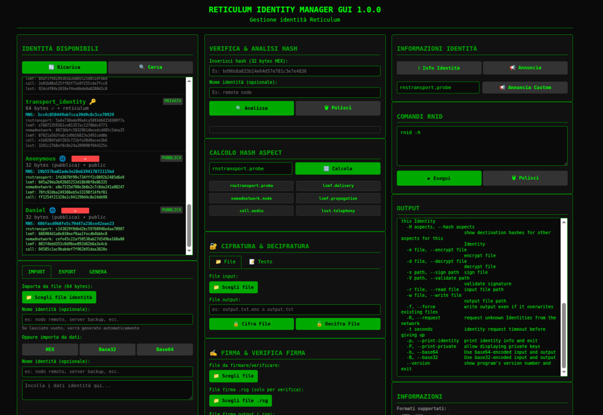
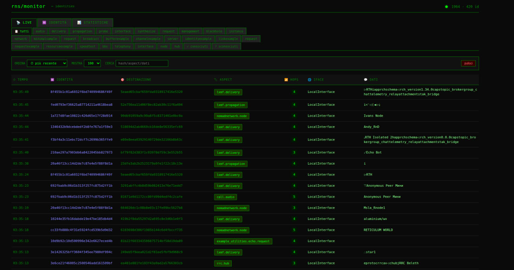
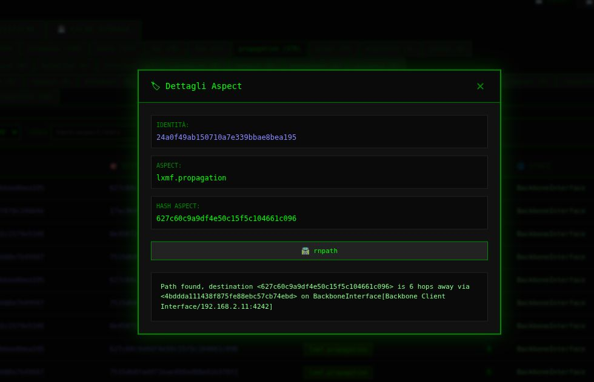
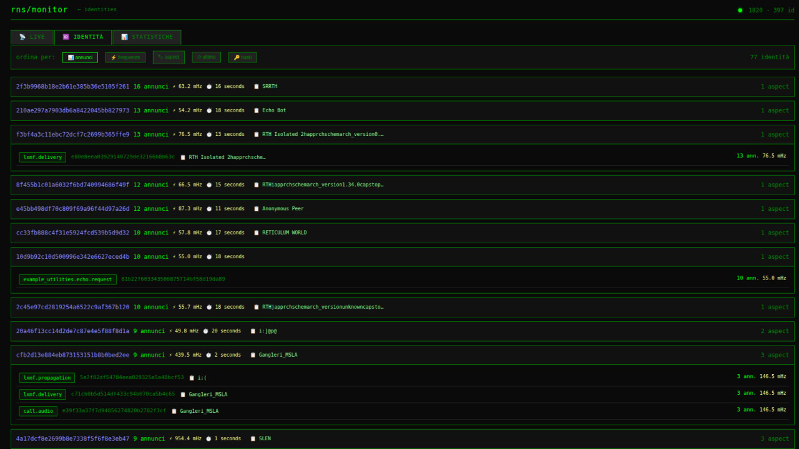
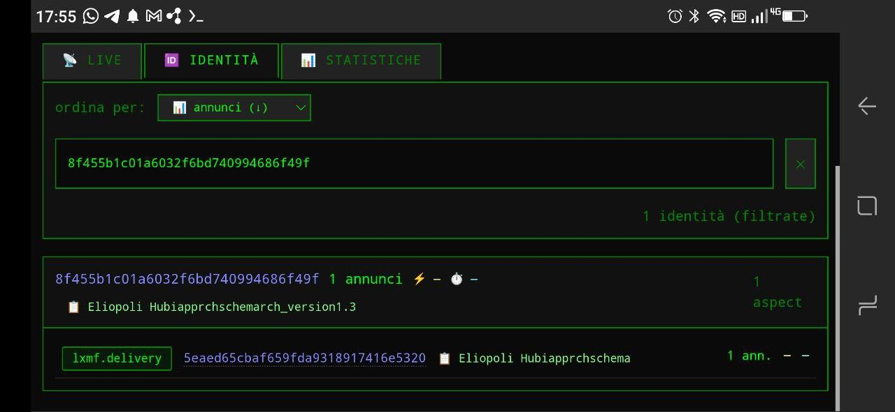
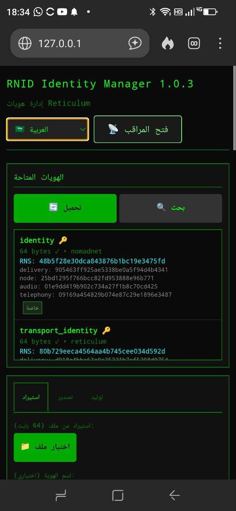
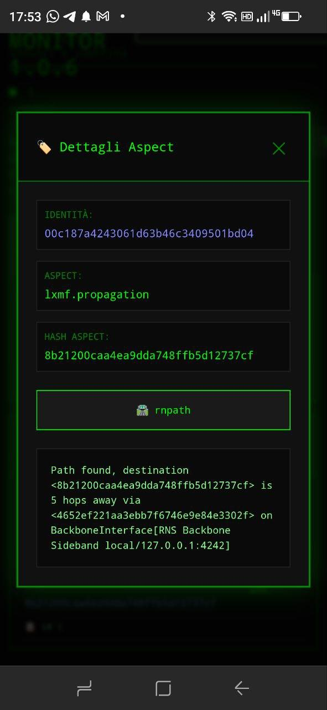

<h1 align="center">
 🔑  RNS Identity Manager & Monitor 🌐
</h1>

A comprehensive web interface for managing Reticulum (RNS) identities and real-time monitoring of network announces.

<h3> 📋 Overview</h3>



This project provides an intuitive web interface for:
- **Managing RNS identities** (create, import, export, view)
- **Monitoring RNS announces** in real-time with advanced filtering
- **Executing RNS commands** (rnstatus, rnpath, rnprobe) through a graphical interface
- **Encrypting/decrypting** files and text with RNS identities
- **Signing and verifying** files digitally

<h3> ✨ Features</h3>

### Identity Manager
- ✅ Display all RNS identities (reticulum, nomadnet, lxmf, rnphone, meshchat)
- ✅ Import/export identities in HEX, Base32, Base64 formats
- ✅ Generate new identities
- ✅ Hash verification and analysis (public identities)
- ✅ Aspect hash calculation for RNS destinations
- ✅ File and text encryption/decryption
- ✅ Digital signing and signature verification (.rsg)



### Aspect Monitor
- 📡 Real-time announce monitoring via SSE (Server-Sent Events)
- 🔍 Aspect filters, text search, sorting
- 📊 Detailed statistics and identity analysis
- 🏷️ Automatic aspect recognition with caching
- 💾 Persistent disk cache (7 days history)
- 🖱️ Interactive modal for rnpath/rnprobe commands



<h3> 🚀 Installation</h3>

### Prerequisites
- Python 3.7 or higher
- Reticulum installed and configured
- rnid, rnstatus, rnpath, rnprobe available in PATH

### Installation

```bash
# Clone the repository
git clone git@github.com:argo79/RNS-Manager.git
cd RNS-Manager

# Install dependencies
pip install flask

# Make sure Reticulum is installed
pip install rns

# Start the server
python3 rns_manager.py


Then open your browser at:

    Identity Manager: http://localhost:5000/

    Aspect Monitor: http://localhost:5000/monitor
```


<h3>📁 Project Structure</h3>

```ini
rns-identity-manager/
├── manager.py                 # Server Flask principale
├── Readme.md                  # This file
├── static/
│   └── rns_monitor.css        # Stili CSS
├── templates/
│   ├── index.html              # Identity Manager
│   └── monitor.html            # Aspect Monitor
└── README.md
```


<h3>🗂️ Directory Structure</h3>

The program searches for identities in:

    ~/.reticulum/storage/

    ~/.nomadnetwork/storage/

    ~/.lxmf/storage/

    ~/.rnphone/

    ~/.reticulum-meshchat/

    ~/.rns_manager/storage/

Cache and downloads:

    ~/.rns_manager/Cache/ - Announce and identity cache

    ~/.rns_manager/Downloads/ - Processed files


<h3>🎮 Usage</h3>

Identity Manager

    Load identities: Press "Load" to display found identities

    Select identity: Click on an identity to select it

    Operations:

        ℹ️ Identity Info - View details

        📢 Announce - Announce an aspect

        Import/Export - Manage identities in various formats

        Generate - Create new identities




Aspect Monitor

    Live view: View real-time announces

    Filters: Filter by aspect, search text, sort

    Identities: Analyze per-identity statistics

    Statistics: Charts and counters

    Click on hashes to open modal with commands:

        🛣️ rnpath - View path

        📡 rnprobe - Send probe

        🕳️ rnpath -p - Check blackhole

<h3>🔧 Configuration</h3>

Identity Cache

Identities are cached for 5 minutes for optimal performance. To force a full scan, press "Deep Scan".
Announce Cache

Announces are automatically saved every 60 seconds and kept for 7 days in ~/.rns_manager/Cache/announce_cache.json.
Path Customization

Modify USER_DIRECTORIES in manager.py to add/remove search directories.

<h3>📊 Available APIs</h3>

Identity Manager

    GET /api/identities/list - List identities (with cache)

    POST /api/identities/import/file - Import from file

    POST /api/identities/import/data - Import from data

    POST /api/identities/export - Export identity

    POST /api/identities/generate - Generate new identity

    POST /api/rnid - Execute rnid command

Monitor

    GET /api/monitor/stats - Monitor statistics

    GET /api/monitor/history - Announce history

    GET /api/monitor/stream - SSE for live updates

    GET /api/monitor/cache/stats - Cache statistics

    POST /api/monitor/cache/clear - Clear cache

RNS Commands

    GET /api/rns/status - rnstatus

    GET /api/rns/paths - rnpath

    POST /api/rns/probe - rnprobe


<h3>📱 Android via Termux</h3>



<p>
    Usable on Android through Termux.
    Open Termux and clone the repository:
</p>

<pre><code class="language-bash">
git clone https://github.com/argo79/RNS-Manager.git

cd RNS-Manager/

pip install -r requirements.txt --break-system-packages

python3 rns_manager.py
</code></pre>

<p>
    Then open your browser on Android and navigate to:
</p>

<pre><code>
http://127.0.0.1:5000
</code></pre>





<h3>🤝 Contributing</h3>

    Fork the project

    Create your feature branch (git checkout -b feature/AmazingFeature)

    Commit your changes (git commit -m 'Add AmazingFeature')

    Push to the branch (git push origin feature/AmazingFeature)

    Open a Pull Request


<h3>📝 License</h3>

Distributed under the MIT License.

[](https://opensource.org/licenses/MIT)
[](https://www.python.org/downloads/)
[](https://flask.palletsprojects.com/)


<h3>🙏 Acknowledgments</h3>

    Reticulum Network Stack - The amazing network stack

    Flask - Lightweight web framework


<h3>📧 Contact</h3>

Arg0net - Arg0netds@gmail.com

Project Link: https://github.com/argo79/RNS-Manager


<h3>🐛 Known Issues</h3>

    Initial identity scan may take 10-30 seconds with many identities

    Some aspects might not be correctly recognized

    On mobile devices, some tables may require horizontal scrolling


<h3>🔜 Roadmap</h3>

    Multi-language support

    Statistics export to CSV/JSON

    Identity group management

    Nomad Network integration for messaging

    Authentication and multi-user support

    Dark/light mode toggle


<h3>📦 Dependencies</h3>

    Flask >= 2.0.0

    Reticulum (rns) >= 0.5.0

    Python >= 3.7


<h3>⚙️ Advanced Configuration</h3>
Cache Duration

You can modify cache duration in rns_manager.py:

```ini
Identity cache (default: 6 hours)
identity_cache = IdentityCache(cache_duration=3600)

Announce cache (default: 7 days)
announce_cache = PersistentAnnounceCache(
    max_age_days=7,
    save_interval=60
)
```

Adding Custom Aspects

Edit RNS_ASPECTS list in rns_manager.py and rns_monitor.html to add custom aspects for recognition.


<h3>🖥️ System Requirements</h3>
<p>
    RAM: Minimum 256MB, recommended 512MB
    Storage: 100MB for logs and cache
    CPU: Any modern processor
    Network: Reticulum-compatible interface
</p>

<h3>📈 Performance Tips</h3>
<p>
    First scan will be slow; subsequent loads use cache
    Limit aspects in RNS_ASPECTS for faster identity scanning
    Use "Load from cache" for instant results
    Clear cache periodically to free disk space
</p>

<h3>🆘 Troubleshooting</h3>

Q: Identities not showing up?
A: Check if paths in USER_DIRECTORIES are correct and contain valid 64-byte identity files.

Q: Monitor shows no announces?
A: Verify Reticulum is running and network interfaces are active.

Q: Cache not working?
A: Ensure ~/.rns_manager/Cache directory is writable.

Q: rnid commands failing?
A: Make sure rnid is installed and in your PATH.

Made with ❤️ for the Reticulum community
